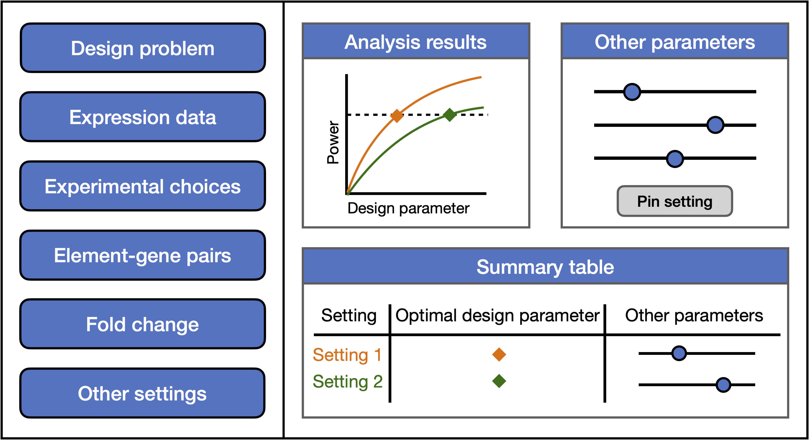

# PerturbPlan App

PerturbPlan is a Shiny app for Perturb-seq and TAP-seq experimental design. It helps balance power and cost, with an emphasis on speed, flexibility, and interactivity.

  <a href="https://katsevich-lab-perturbplan.share.connect.posit.cloud/" class="launch-button">
    🚀 Launch App
  </a>

## Interface overview

  

PerturbPlan is structured around solving 11 commonly encountered design problems. The workflow of the app is as follows:

1. **Select a design problem**: Choose one of 11 predefined design problems that best matches your experimental goals.

2. **Configure design parameters**: Set the parameters for your experimental choices, analysis choices, expected effect sizes, and (optionally) advanced settings. Click "Plan".

3. **View your analysis results**: The plot illustrates graphically how the design problem was solved, and the table below summarizes the optimal design parameters.

4. **Explore parameter settings.** Use the sliders to adjust key parameters and see how they affect the optimal design. Pin parameter settings to compare multiple designs.

5. **Export your results.** Click the export buttons to download the plot and a detailed Excel spreadsheet containing the results.

6. **Start over.** Click the "Restart" button to start from scratch.

We elaborate on steps 1 and 2 in the [full documentation](articles/perturbplanapp.html).
