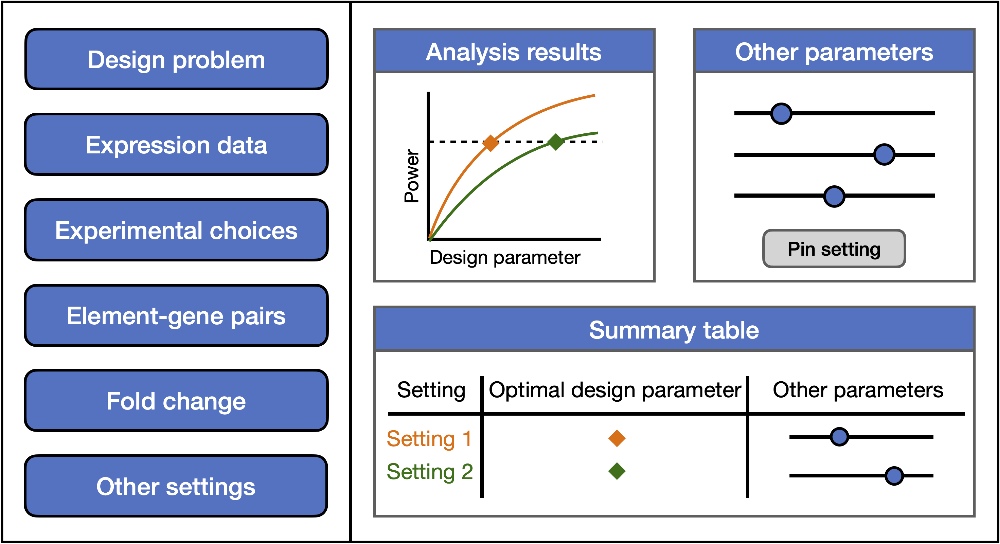

# PerturbPlan App

PerturbPlan is a Shiny app for Perturb-seq and TAP-seq experimental design. It helps balance power and cost, with an emphasis on speed, flexibility, and interactivity.

  

## Design problem overview

PerturbPlan is structured around solving 11 commonly encountered design problems. Each design problem involves the following parameters:

- **Power**: The expected proportion of perturbation-gene effects that are detected.
- **Cost**: The total experimental cost, determined by the number of cells and sequencing reads.
- **Cells / target**: The average number of cells receiving CRISPR perturbations of a given target.
- **Reads / cell**: The average number of sequenced reads per cell.
- **Expr. thresh.**: The expression threshold (in TPM or UMIs/cell) below which genes are excluded from the analysis.
- **Fold change**: The weakest perturbation effect of interest, expressed as a multiplicative change in mean gene expression.

The table below summarizes how each parameter is treated in each of the 11 design problems.

**Key:** &ge; Constrain from below | &le; Constrain from above | = Fix at value | min Minimize | var Allow to vary | N/A Not involved

<table border="1">
<thead>
<tr>
<th width="3%" align="center"></th>
<th width="6%" align="center">Power</th>
<th width="6%" align="center">Cost</th>
<th width="10%" align="center">Cells / target</th>
<th width="10%" align="center">Reads / cell</th>
<th width="10%" align="center">Expr. thresh.</th>
<th width="10%" align="center">Fold change</th>
<th width="45%">Example design problem</th>
</tr>
</thead>
<tbody>
<tr><td align="center">1</td><td align="center">&ge;</td><td align="center">N/A</td><td align="center">min</td><td align="center">=</td><td align="center">=</td><td align="center">=</td><td>Find the smallest cells/target to achieve at least 80% power to detect 15% FC for genes with at least 1 TPM, assuming 10k reads per cell.</td></tr>
<tr><td align="center">2</td><td align="center">&ge;</td><td align="center">N/A</td><td align="center">=</td><td align="center">min</td><td align="center">=</td><td align="center">=</td><td>Find the smallest reads/target to achieve at least 80% power to detect 15% FC for genes with at least 1 TPM, assuming 500 cells/target.</td></tr>
<tr><td align="center">3</td><td align="center">&ge;</td><td align="center">N/A</td><td align="center">=</td><td align="center">=</td><td align="center">=</td><td align="center">min</td><td>Find the smallest FC against which the power is at least 80% for genes with at least 1 TPM, assuming 500 cells/target and 10k reads/cell.</td></tr>
<tr><td align="center">4</td><td align="center">&ge;</td><td align="center">N/A</td><td align="center">=</td><td align="center">=</td><td align="center">min</td><td align="center">=</td><td>Find the smallest expression threshold for which power to detect 15% FC is at least 80%, assuming 500 cells/target and 10k reads/cell.</td></tr>
<tr><td align="center">5</td><td align="center">&ge;</td><td align="center">min</td><td align="center">var</td><td align="center">var</td><td align="center">=</td><td align="center">=</td><td>What is the minimum-cost combination of cells/target and reads/cell achieving at least 80% power to detect 15% FC for genes with at least 1 TPM?</td></tr>
<tr><td align="center">6</td><td align="center">&ge;</td><td align="center">&le;</td><td align="center">var</td><td align="center">var</td><td align="center">=</td><td align="center">min</td><td>Within a $20k budget, what combination of cells/target and reads/cell give the minimum FC against which power is at least 80% for genes with at least 1 TPM?</td></tr>
<tr><td align="center">7</td><td align="center">&ge;</td><td align="center">&le;</td><td align="center">var</td><td align="center">=</td><td align="center">=</td><td align="center">min</td><td>Within a $20k budget, what value of cells/target gives the minimum FC against which power is at least 80% for genes with at least 1 TPM, assuming 10k reads/cell?</td></tr>
<tr><td align="center">8</td><td align="center">&ge;</td><td align="center">&le;</td><td align="center">=</td><td align="center">var</td><td align="center">=</td><td align="center">min</td><td>Within a $20k budget, what value of reads/cell gives the minimum FC against which power is at least 80% for genes with at least 1 TPM, assuming 500 cells/target?</td></tr>
<tr><td align="center">9</td><td align="center">&ge;</td><td align="center">&le;</td><td align="center">var</td><td align="center">var</td><td align="center">min</td><td align="center">=</td><td>Within a $20k budget, what combination of cells/target and reads/cell give the smallest TPM threshold for which power to detect a 15% FC is at least 80%?</td></tr>
<tr><td align="center">10</td><td align="center">&ge;</td><td align="center">&le;</td><td align="center">var</td><td align="center">=</td><td align="center">min</td><td align="center">=</td><td>Within a $20k budget, what value of cells/target gives the smallest TPM threshold for which power to detect a 15% FC is at least 80%, assuming 10k reads/cell?</td></tr>
<tr><td align="center">11</td><td align="center">&ge;</td><td align="center">&le;</td><td align="center">=</td><td align="center">var</td><td align="center">min</td><td align="center">=</td><td>Within a $20k budget, what value of reads/cell gives the smallest TPM threshold for which power to detect a 15% FC is at least 80%, assuming 500 cells/target?</td></tr>
</tbody>
</table>

## Interface overview

  

The workflow of the app is as follows:

1. **Select a design problem**: Choose one of 11 predefined design problems that best matches your experimental goals. See the [Design problem overview](#design-problem-overview) above for details.

2. **Configure design parameters**: Set the parameters for your experimental choices, analysis choices, expected effect sizes, and (optionally) advanced settings. Click "Plan".

3. **View your analysis results**: The plot illustrates graphically how the design problem was solved, and the table below summarizes the optimal design parameters.

4. **Explore parameter settings.** Use the sliders to adjust key parameters and see how they affect the optimal design. Pin parameter settings to compare multiple designs.

5. **Export your results.** Click the export buttons to download the plot and a detailed Excel spreadsheet containing the results.

6. **Start over.** Click the "Restart" button to start from scratch.

We elaborate on steps 1 and 2 in the [full documentation](https://katsevich-lab.github.io/perturbplanApp/articles/perturbplanapp.html).
